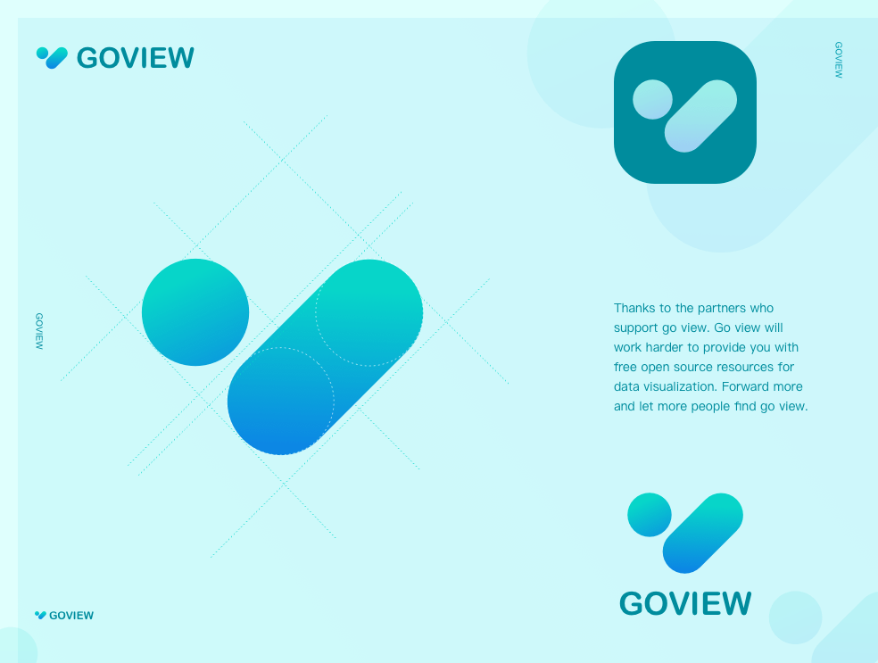

## 总览


**`master-fetch` 分支是带有后端接口请求的分支**

**后端项目地址：[https://gitee.com/MTrun/go-view-serve](https://gitee.com/MTrun/go-view-serve)**

**接口说明地址：[https://docs.apipost.cn/preview/5aa85d10a59d66ce/ddb813732007ad2b?target_id=84dbc5b0-158f-4bcb-8f74-793ac604ada3#3e053622-1e76-43f9-a039-756aee822dbb](https://docs.apipost.cn/preview/5aa85d10a59d66ce/ddb813732007ad2b?target_id=84dbc5b0-158f-4bcb-8f74-793ac604ada3#3e053622-1e76-43f9-a039-756aee822dbb)**

## 使用

所有的接口地址位置：`src\api\path\*`

接口地址修改：`.env`

```shell
# port
VITE_DEV_PORT = '8080'

# development path
VITE_DEV_PATH = 'http://127.0.0.1:8080'

# production path
VITE_PRO_PATH = 'http://127.0.0.1:8080'
```

公共前缀修改：`src\settings\httpSetting.ts`

```shell
// 请求前缀
export const axiosPre = '/goview'
```

接口封装：`src\api\http.ts`

```ts
import axiosInstance from './axios'
import { RequestHttpEnum, ContentTypeEnum } from '@/enums/httpEnum'

export const get = (url: string, params?: object) => {
  return axiosInstance({
    url: url,
    method: RequestHttpEnum.GET,
    params: params,
  })
}

export const post = (url: string, data?: object, headersType?: string) => {
  return axiosInstance({
    url: url,
    method: RequestHttpEnum.POST,
    data: data,
    headers: {
      'Content-Type': headersType || ContentTypeEnum.JSON
    }
  })
}

export const put = (url: string, data?: object, headersType?: string) => {
  return axiosInstance({
    url: url,
    method: RequestHttpEnum.PUT,
    data: data,
    headers: {
      'Content-Type': headersType || ContentTypeEnum.JSON
    }
  })
}

export const del = (url: string, params?: object) => {
  return axiosInstance({
    url: url,
    method: RequestHttpEnum.DELETE,
    params
  })
}

// 获取请求函数，默认get
export const http = (type?: RequestHttpEnum) => {
  switch (type) {
    case RequestHttpEnum.GET:
      return get

    case RequestHttpEnum.POST:
      return post

    case RequestHttpEnum.PUT:
      return put

    case RequestHttpEnum.DELETE:
      return del

    default:
      return get
  }
}

```
## 交流


QQ 群：1030129384



