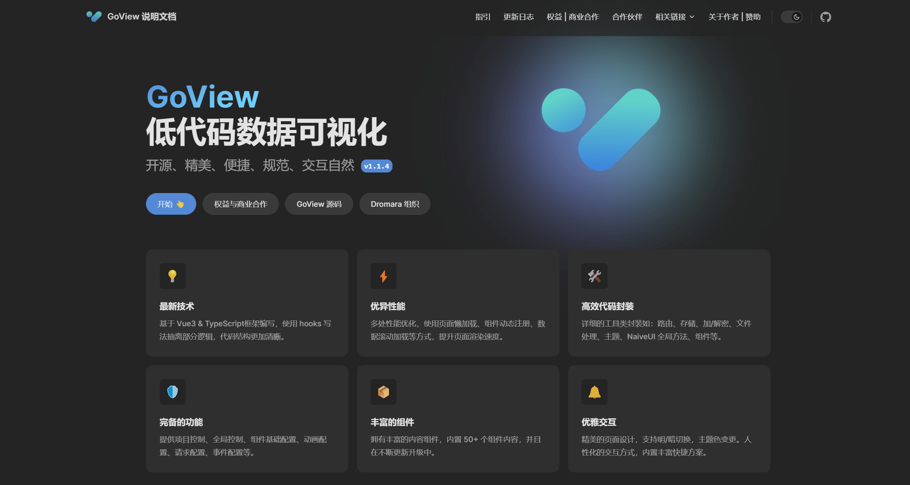
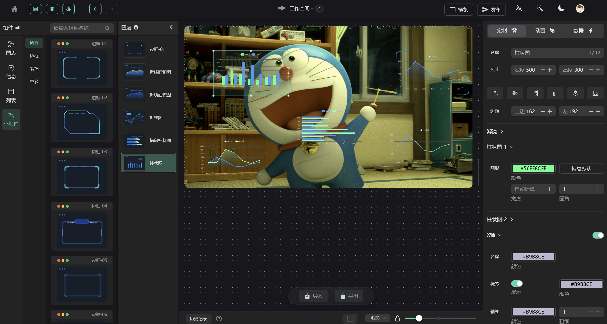
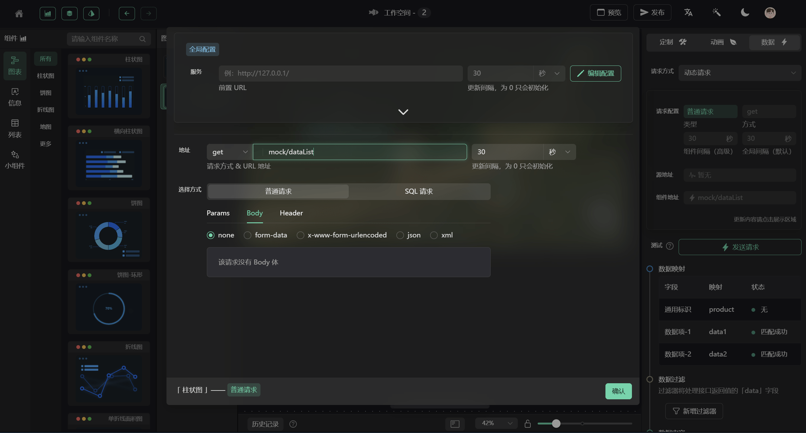
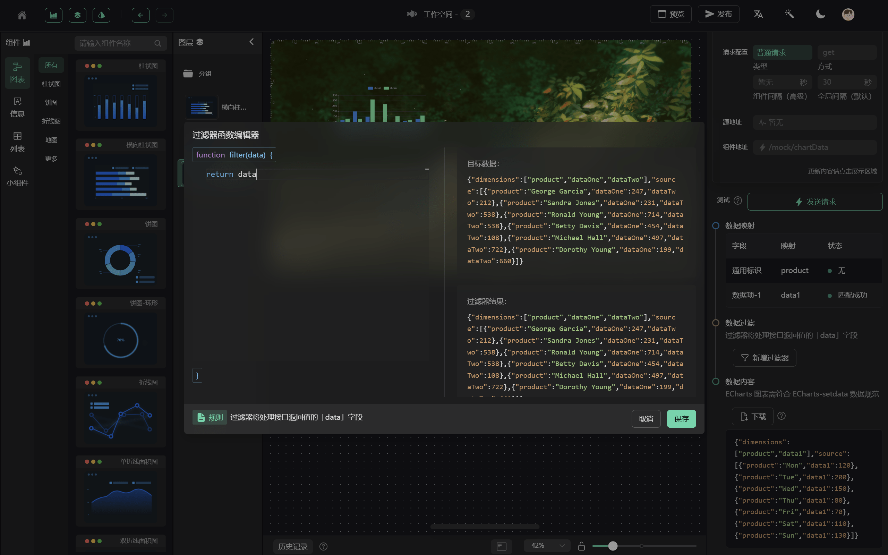
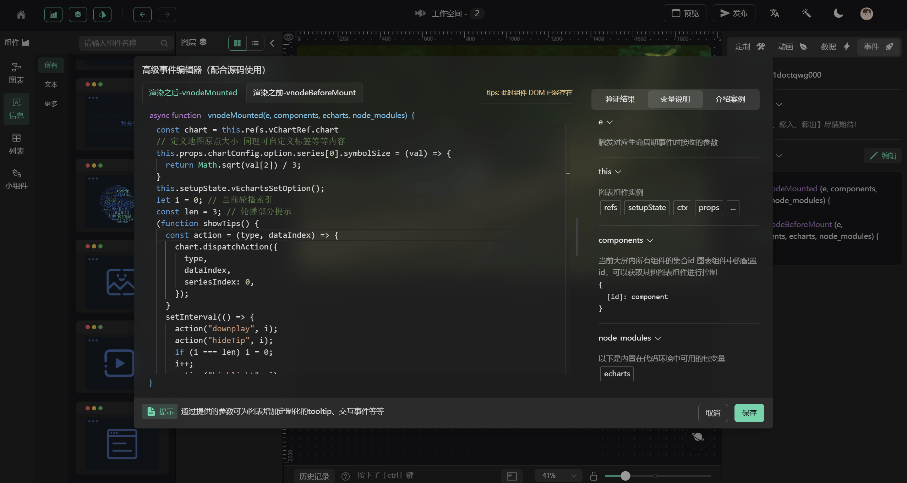
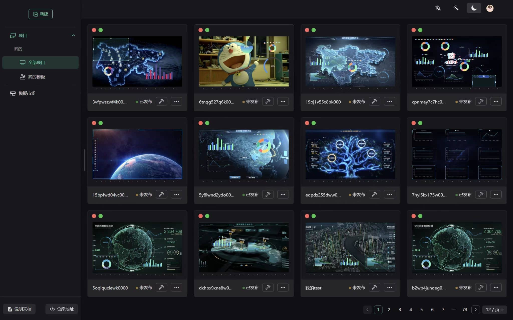
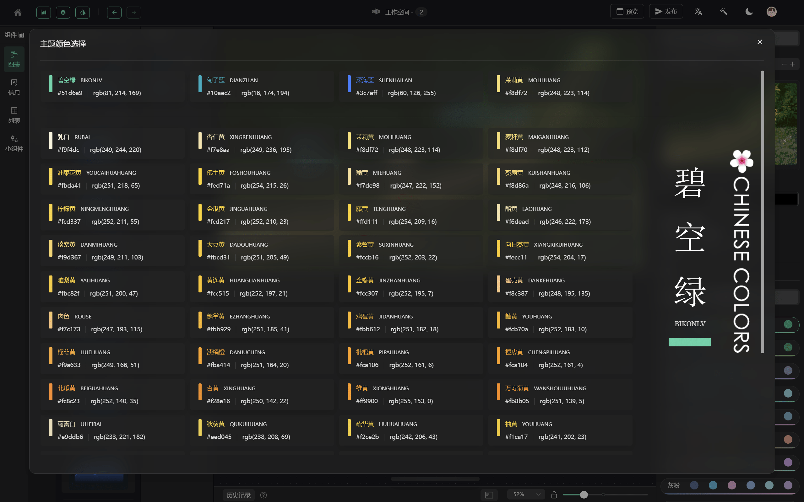
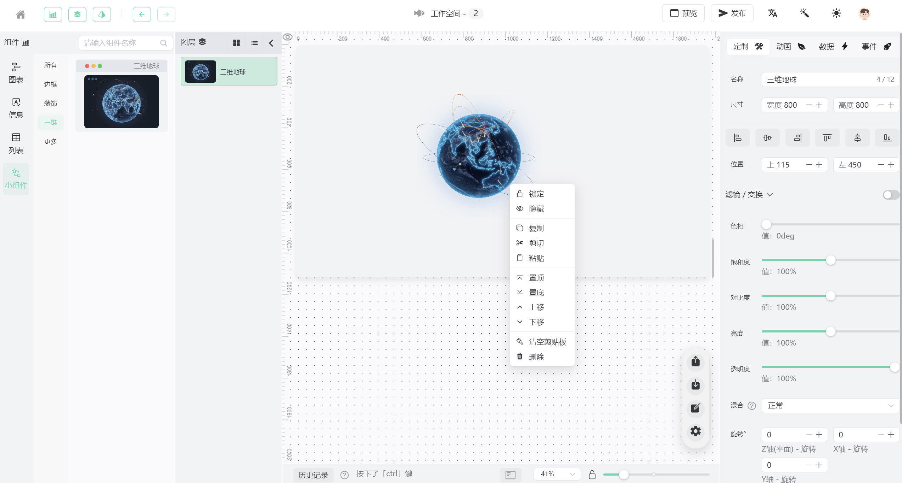

### 最新的代码将第一时间在码云 [Gitee] 上更新，更建议您前往码云进行查看 👉：https://gitee.com/dromara/go-view

##

<p align="center">
    
</p>

<h4 align="center">开源、精美、便捷的「数据可视化」低代码开发平台</h4>

### 😶 纯 **前端** 分支： **`master`**

### 👻 携带 **后端** 请求分支: **`master-fetch`**

### 📚 GoView **文档** 地址：[http://www.mtruning.club:81/](http://www.mtruning.club:81/)

项目纯前端-Demo 地址：[https://www.mtruning.club](https://www.mtruning.club)

项目带后端-Demo 地址：[后端 Demo 地址](http://1.117.240.165:8080/goview/#/login)

文档-在线地址：[http://www.mtruning.club:81/](http://www.mtruning.club:81/)

文档-源码地址：[https://gitee.com/MTrun/go-view-doc](https://gitee.com/MTrun/go-view-doc)

### 🤯 后端项目

后端项目 gitee 地址：[https://gitee.com/MTrun/go-view-serve](https://gitee.com/MTrun/go-view-serve)

接口说明地址：[https://docs.apipost.cn/preview/5aa85d10a59d66ce/ddb813732007ad2b?target_id=84dbc5b0-158f-4bcb-8f74-793ac604ada3#3e053622-1e76-43f9-a039-756aee822dbb](https://docs.apipost.cn/preview/5aa85d10a59d66ce/ddb813732007ad2b?target_id=84dbc5b0-158f-4bcb-8f74-793ac604ada3#3e053622-1e76-43f9-a039-756aee822dbb)

技术点：

- 框架：基于 `Vue3` 框架编写，使用 `hooks` 写法抽离部分逻辑，使代码结构更加清晰；

- 类型：使用 `TypeScript` 进行类型约束，减少未知错误发生概率，可以大胆修改逻辑内容；

- 性能：多处性能优化，使用页面懒加载、组件动态注册、数据滚动加载等方式，提升页面渲染速度；

- 存储：拥有本地记忆，部分配置项采用 `storage` 存储本地，提升使用体验；

- 封装：项目进行了详细的工具类封装如：路由、存储、加/解密、文件处理、主题、NaiveUI 全局方法、组件等

说明文档：


工作台：


请求配置：


数据过滤：


高级事件编辑:


快捷主页：


主题色：


亮白主题：


主要技术栈为：

| 名称                | 版本  | 名称        | 版本   |
| ------------------- | ----- | ----------- | ------ |
| Vue                 | 3.2.x | TypeScript4 | 4.6.x  |
| Vite                | 2.9.x | NaiveUI     | 2.27.x |
| ECharts             | 5.3.x | Pinia       | 2.0.x  |
| [VChart](https://visactor.io/vchart)              | 2.0.x | 其余详见 `package.json`       | 👈  |
| 详见 `package.json` | 😁    | 🥰          | 🤗     |

开发环境:

| 名称 | 版本    | 名称    | 版本  |
| ---- | ------- | ------- | ----- |
| node | 16.14.x | npm     | 8.5.x |
| pnpm | 7.1.x   | windows | 11    |

已完成图表：

| 分类   | 名称             | 名称             | 名称     |
| ------ | ---------------- | ---------------- | -------- |
| 图表   | 柱状图           | 横向柱状图       | 折线图   |
| \*     | 单/多 折线面积图 | 饼图             | 水球图   |
| \*     | 环形图           | NaiveUI 多种进度 | 🤠       |
| 信息   | 文字             | 图片             | 😶       |
| 列表   | 滚动排名列表     | 滚动表格         | 🤓       |
| 小组件 | 边框-01~13       | 装饰-01~05       | 数字翻牌 |

## 浏览器支持

开发和测试平台均在 `Google` 和最新版 `EDGE` 上完成，暂未测试 `IE11` 等其它浏览器，如有需求请自行测试与兼容。

## 安装

本项目采用` pnpm` 进行包管理

```shell
#建议使用 nrm 切换到淘宝源 https://registry.npmmirror.com/
#pnpm
pnpm install

#yarn
yarn install

#npm
npm install
```

## 启动

```shell
#pnpm
pnpm dev

# npm
npm run dev

#yarn
yarn dev

#Makefile
make dev
```

## 编译

```shell
#pnpm
pnpm run build

# npm
npm run build

#yarn
yarn run build

#Makefile
make dist

```

## 代码提交

- feat: 新功能
- fix: 修复 Bug
- docs: 文档修改
- perf: 性能优化
- revert: 版本回退
- ci: CICD 集成相关
- test: 添加测试代码
- refactor: 代码重构
- build: 影响项目构建或依赖修改
- style: 不影响程序逻辑的代码修改
- chore: 不属于以上类型的其他类型(日常事务)

## 交流

QQ 交流群 和 作者 QQ：

<div style="display: flex; flex-wrap: wrap; gap: 10px">
  
  
</div>


